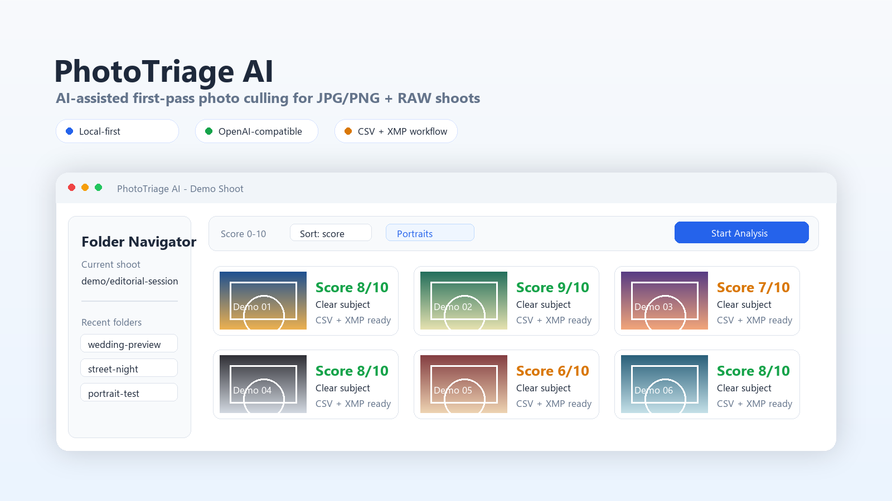
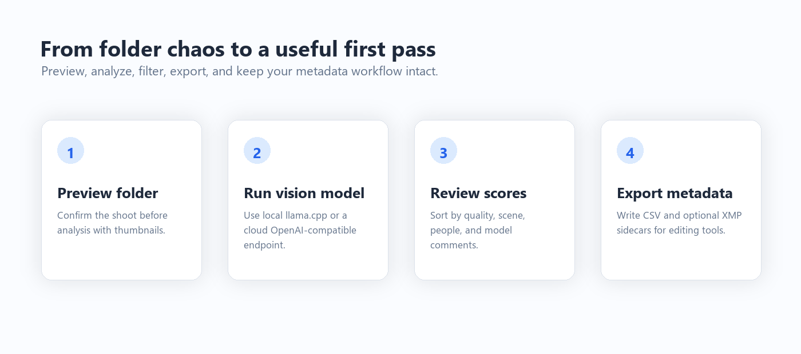
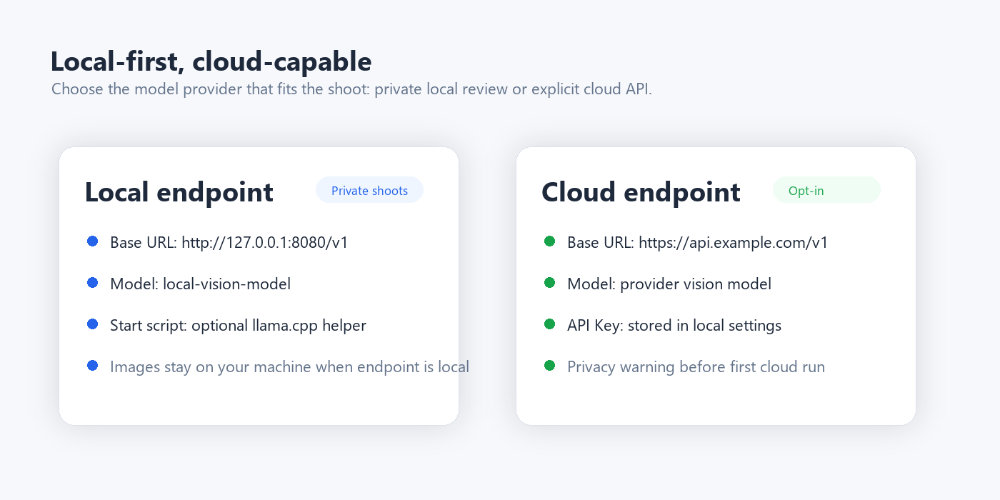

# PhotoTriage AI

[](https://github.com/pqzmwoxn6543210-cpu/PhotoTriage-AI/actions/workflows/tests.yml)


AI-assisted photo culling for photographers who shoot too much and still want to make the final call themselves.

PhotoTriage AI is a desktop tool for reviewing JPG/PNG + RAW shoots with a vision-language model. It previews folders before analysis, scores each image, writes structured CSV output, and can optionally write Lightroom/Capture One friendly XMP metadata.

The goal is simple: make the first pass faster without turning photo selection into a black box.

> Status: early desktop prototype. Tested primarily on Windows with local and cloud OpenAI-compatible vision endpoints.



## What It Does

PhotoTriage AI helps you move from a folder full of images to a cleaner, more searchable first-pass selection.

- Browse folders with thumbnail previews before committing to analysis
- Preview thumbnails even before model analysis has run
- Pair JPG/PNG files with matching RAW files by filename
- Send resized previews to a local or cloud OpenAI-compatible vision model
- Score technical quality, composition, lighting, color, subject clarity, story, and portrait-specific details
- Export structured CSV results for review, filtering, or external tools
- Write XMP metadata, including a safer sidecar-only mode
- Filter, sort, compare, export, discard, and undo from the GUI
- Use custom prompt profiles for different judging styles
- Switch between Simplified Chinese and English UI infrastructure

## Why This Exists

Culling is one of the least glamorous parts of photography. A shoot may contain hundreds or thousands of near-duplicates, test frames, missed expressions, soft focus, odd gestures, and a few genuinely good moments hiding in the pile.

Lightroom can organize and rate photos, but it does not understand what is in them. PhotoTriage AI lets a vision model act as a first-pass assistant: it looks at the image, gives a structured opinion, explains strengths and weaknesses, and leaves you with a more useful starting point.

It does not replace taste. It gives your taste less repetitive work to fight through.

## Preview

The current app is still evolving, but the core workflow is already in place:

- a folder picker with live thumbnail preview
- a thumbnail grid for analysed and unanalysed photos
- a folder navigator for recent/current directories
- a settings panel for local and cloud model providers
- progress, statistics, and CSV/XMP workflow panels



## Privacy Model

PhotoTriage AI is designed to make privacy choices explicit.

Local mode:

- Images are resized on your computer.
- Resized image data is sent only to your configured local endpoint, such as `llama.cpp` server.
- Your original photos remain on disk.

Cloud mode:

- Cloud providers are opt-in.
- Resized image data is sent to the configured API provider.
- The app shows a privacy warning before the first cloud run.
- API keys are stored only in local desktop settings and should never be committed.

Generated CSV/XMP output may contain private shoot information, so common output files are ignored by default. See [docs/privacy.md](docs/privacy.md) and [SECURITY.md](SECURITY.md).

## Model Providers

The analysis core uses an OpenAI-compatible chat completions API:

```text
/v1/chat/completions
```

Supported provider modes:

- Local `llama.cpp` or another local OpenAI-compatible vision endpoint
- Cloud OpenAI-compatible vision APIs

In Settings -> Server, configure:

- Provider type
- Base URL, for example `http://127.0.0.1:8080/v1` or `https://api.example.com/v1`
- Model name
- API key, if required

For local `llama.cpp`, copy [start-triage-server.example.bat](start-triage-server.example.bat) to `start-triage-server.bat`, edit the paths, and select it in Settings. The real `start-triage-server.bat` is ignored so personal model paths do not enter the repository.



## Quick Start

Install dependencies:

```bash
python -m pip install -r requirements.txt
```

Start the GUI:

```bash
python app.py
```

Basic workflow:

1. Configure a local or cloud OpenAI-compatible vision model in Settings.
2. Choose a photo folder with the folder picker.
3. Preview thumbnails to confirm it is the right shoot.
4. Start analysis.
5. Review scores, comments, filters, and thumbnails.
6. Export, discard, undo, or write XMP metadata as needed.

## Metadata Workflow

PhotoTriage AI can write model-generated review data into metadata:

- CSV: structured analysis rows for every processed image
- XMP sidecar: safer mode that avoids modifying JPG/PNG files
- Embedded XMP: writes metadata into JPG/PNG and sidecars for RAW files

Sidecar mode is recommended when testing the app on important shoots.

## Internationalization

The UI has a lightweight JSON-based translation system.

Current language catalogs:

- Simplified Chinese: [i18n/zh-CN.json](i18n/zh-CN.json)
- English: [i18n/en-US.json](i18n/en-US.json)

More languages can be added by creating another JSON catalog with the same keys.

## Project Structure

```text
app.py                         GUI entry point
triage.py                      Core scan, model call, CSV/XMP workflow
core/                          Shared helpers such as i18n and providers
gui/                           PySide6 desktop UI
  main_window.py               Main frame and menus
  task_panel.py                Folder/run controls
  folder_picker_dialog.py      Folder picker with thumbnail preview
  results_view.py              Thumbnail grid, filtering, batch actions
  thumbnail_gen.py             Background thumbnail cache
  settings_dialog.py           Settings UI
i18n/                          Translation dictionaries
tests/                         Unit tests
docs/                          Architecture, privacy, and roadmap docs
```

## Development

Run tests:

```bash
python -m unittest discover -s tests -v
```

Run a lightweight GUI smoke test:

```powershell
$env:QT_QPA_PLATFORM='offscreen'
python - <<'PY'
from PySide6.QtWidgets import QApplication
from gui.main_window import MainWindow

app = QApplication([])
win = MainWindow()
print(win.windowTitle())
PY
```

Useful docs:

- [Architecture](docs/architecture.md)
- [Privacy](docs/privacy.md)
- [Open-source roadmap](docs/open_source_roadmap.md)
- [Development plan](docs/development_plan.md)
- [Changelog](CHANGELOG.md)
- [Contributing](CONTRIBUTING.md)

## Roadmap

Near-term priorities:

- Improve first-run setup for local and cloud providers
- Finish full translation coverage across every dialog
- Add README screenshots and release assets
- Package portable Windows builds
- Add provider presets for common services
- Improve RAW embedded-preview extraction

See [docs/open_source_roadmap.md](docs/open_source_roadmap.md) for more detail.

## Who This Is For

PhotoTriage AI is for photographers who:

- shoot JPG+RAW or JPG/PNG batches
- want a faster first pass before detailed editing
- prefer local-first tooling but want optional cloud models
- use Lightroom, Capture One, Bridge, or metadata-aware workflows
- want model feedback that is visible, editable, and exportable

It is probably not the right tool if you want a fully automatic final selector. The best use is as a tireless first reader, not a replacement editor.

## License

MIT. See [LICENSE](LICENSE).
